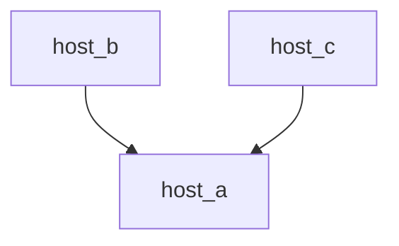

# dds-router

Fast DDS Router Docker image with auto-configuration for Husarnet VPN.

## Environment Variables

| env | default value | description |
| - | - | - |
| `AUTO_CONFIG` | `TRUE` | If set to `TRUE``, the `DDS_ROUTER_CONFIGURATION.yaml`` will be automatically generated using all other environment variables. Set to `FALSE`` to use a custom DDS Router configuration, **bypassing all other environment variables** |
| `USE_HUSARNET` | `TRUE` | When set to `TRUE`, the DDS Router configuration file populates with Husarnet peers addresses. If `FALSE`, the DDS Router operates solely within the local network, defaulting to the DDS simple discovery protocol. In this scenario, the first participant's domain id is `ROS_DOMAIN_ID`, while the second participant's domain id is consistently `0`. However, if `ROS_DOMAIN_ID=0`, the first participant's domain id defaults to `77` to prevent both participants from having a domain id of `0`. |
| `FAIL_IF_HUSARNET_NOT_AVAILABLE` | `FALSE` | When set to `FALSE`, if the Husarnet Daemon HTTP API is unreachable, the system behaves as though USE_HUSARNET=FALSE. When set to `TRUE`, the container stops if it cannot connect to the Husarnet Daemon API. |
| `ROS_DOMAIN_ID` | `0` | from `0` to `232`. |
| `LOCAL_TRANSPORT` | `udp` | `udp` for UDP based local DDS setup, `builtin` for a shared memory based local DDS setup (if using `builtin` with `--network host`, remember to add also `--ipc host `). |
| `DISCOVERY` | `WAN` | `WAN` for the [WAN Participant (initial peers)](https://eprosima-dds-router.readthedocs.io/en/latest/rst/user_manual/participants/wan.html#user-manual-participants-wan) setup, `SERVER` or `CLIENT` for [Local Discovery Server Participant](https://eprosima-dds-router.readthedocs.io/en/latest/rst/user_manual/participants/local_discovery_server.html#user-manual-participants-local-discovery-server) setup. |
| `DS_HOSTNAME` | `master` | Use the `DS_HOSTNAME` to specify the Husarnet hostname for devices set with `DISCOVERY=SERVER`. Ensure that both `SERVER` and `CLIENT` devices have the same `DS_HOSTNAME`. Ignored when `DISCOVERY=WAN`. |
| `DS_CLIENT_ID` | `1` | The ID of the client if `DISCOVERY=CLIENT`. Each client conntected to the Discovery Server need to has a differnet `DS_CLIENT_ID`. Don't use it if `DISCOVERY=WAN`. |
| `DS_SERVER_ID` | `0` | Specify the server's ID by setting it for both `DISCOVERY=CLIENT` and `DISCOVERY=SERVER`. Do not use this setting if DISCOVERY=WAN. |

## Example Setups

### Setup 1

Husarnet operates on the Host OS. ROS 2 nodes on the host use `ROS_DOMAIN_ID=1`, and the goal is to ensure all ROS 2 topics are accessible to other peers in the Husarnet network. The DDS Router should also restart with each reboot of the host OS.

1. Docker Compose

```yaml
services:
  ddsrouter:
    image: husarnet/dds-router:v2.0.0
    restart: always
    network_mode: host
    environment:
      - ROS_DOMAIN_ID=1
```

2. Docker run

```bash
docker run --name ddsrouter \
--restart always \
--network host \
-e ROS_DOMAIN_ID=1 \
husarnet/dds-router:v2.0.0
```

### Setup 2

Husarnet operates on the Host OSes with hostnames `host_a` and `host_b`, and `host_c`. The goal is to ensure all ROS 2 topics are accessible to other peers in the Husarnet network. We want to use a Discovery Server setup, where `host_a` is a server, and `host_b` and `host_c` are clients.



1. `compose.yaml` for `host_a`:

```yaml
services:
  ddsrouter:
    image: husarnet/dds-router:v2.0.0
    network_mode: host
    environment:
      - DISCOVERY=SERVER
      - DS_HOSTNAME=host_a
```

2. `compose.yaml` for `host_b`:

```yaml
services:
  ddsrouter:
    image: husarnet/dds-router:v2.0.0
    network_mode: host
    environment:
      - DISCOVERY=CLIENT
      - DS_HOSTNAME=host_a
      - DS_CLIENT_ID=1
```

3. `compose.yaml` for `host_c`:

```yaml
services:
  ddsrouter:
    image: husarnet/dds-router:v2.0.0
    network_mode: host
    environment:
      - DISCOVERY=CLIENT
      - DS_HOSTNAME=host_a
      - DS_CLIENT_ID=2
```

### Setup 3

Husarnet runs on the Host OS. While ROS 2 nodes on the are in `ROS_DOMAIN_ID=0` (default), the aim is to make only the `/chatter` topic available to other peers within the Husarnet network.

1. `compose.yaml`

```yaml
services:
  ddsrouter:
    image: husarnet/dds-router:v2.0.0
    network_mode: host
    volumes:
      - ./filter.yaml:/filter.yaml
```

2. `filter.yaml`

```yaml
allowlist:
  - name: "rt/chatter"
    type: "std_msgs::msg::dds_::String_"
blocklist: []
builtin-topics: []
```

## Quick Start

### Option 1: Initial Peers config

1. Connect both hosts to the same Husarnet network (eg. named `host_A` and `host_B`).

2. On both `host_A` and `host_B` execute:

```bash
docker run \
--detach \
--restart=unless-stopped \
--network host \
-e ROS_DOMAIN_ID \
husarnet/dds-router:v2.0.0
```

3. Start a chatter demo:

- on the `host_A`:

```bash
ros2 run demo_nodes_cpp talker
```

- on the `host_B`:

```bash
ros2 run demo_nodes_cpp listener
```

### Option 2: Discovery Server config

1. Connect both hosts to the same Husarnet network (eg. named `host_A` and `host_B`).

2. Execute on `host_A`:

```bash
docker run \
--detach \
--restart=unless-stopped \
--network host \
-e DISCOVERY=SERVER \
-e DS_HOSTNAME=host_A \
husarnet/dds-router:v2.0.0
```

3. Execute on `host_B`:

```bash
docker run \
--detach \
--restart=unless-stopped \
--network host \
-e DISCOVERY=CLIENT \
-e DS_HOSTNAME=host_A \
husarnet/dds-router:v2.0.0
```

4. Start a chatter demo:

- on the `host_A`:

```bash
ros2 run demo_nodes_cpp talker
```

- on the `host_B`:

```bash
ros2 run demo_nodes_cpp listener
```

### Option 3: custom config

1. Connect both hosts to the same Husarnet network (eg. named `host_A` and `host_B`).

2. Create a DDS Router config file on the `host_A`:

```bash
user@host_A:~$ vim config.yaml
```

with the following content:


```yaml
version: v3.0

allowlist:
  - name: "rt/chatter"
    type: "std_msgs::msg::dds_::String_"

participants:

  - name: SimpleParticipant
    kind: local
    domain: 0

  - name: ServerDSParticipant
    kind: local-discovery-server
    discovery-server-guid:
      id: 200
    listening-addresses:
      - domain: host_A
        port: 11811
        transport: udp
```

3. Create a DDS Router config file on the `host_B`:

```bash
user@host_B:~$ vim config.yaml
```

with the following content:


```yaml
version: v3.0

allowlist:
  - name: "rt/chatter"
    type: "std_msgs::msg::dds_::String_"

participants:

  - name: SimpleParticipant
    kind: local
    domain: 0

  - name: ClientDSParticipant
    kind: local-discovery-server
    discovery-server-guid:
      id: 202
    connection-addresses:
      - discovery-server-guid:
          id: 200
        addresses:
          - domain: host_A 
            port: 11811
            transport: udp
```

4. On both `host_A` and `host_B` execute (in the same folder as `config.yaml` file):

```bash
docker run --name dds-router \
  --restart=unless-stopped \
  --network host \
  --ipc host \
  --user $(id -u):$(id -g) \
  -v $(pwd)/config.yaml:/config.yaml \
  -v /etc/group:/etc/group:ro \
  -v /etc/passwd:/etc/passwd:ro \
  -v /etc/shadow:/etc/shadow:ro \
  -e AUTO_CONFIG=FALSE \
  husarnet/dds-router:v2.0.0 bash -c "ddsrouter -c /config.yaml -r 10"
```

5. Start a chatter demo:

- on the `host_A`:

```bash
export ROS_DOMAIN_ID=0
ros2 run demo_nodes_cpp talker
```

- on the `host_B`:

```bash
export ROS_DOMAIN_ID=0
ros2 run demo_nodes_cpp listener
```

## Topic Filtering

The repo contains the `create_filter.sh` script allowing you to automate the process of creating a [DDS Router filter rules](https://eprosima-dds-router.readthedocs.io/en/latest/rst/user_manual/configuration.html#id1):

```bash
curl -s https://raw.githubusercontent.com/husarnet/dds-router/topic-filtering/create_filter.sh > create_filter.sh
chmod +x create_filter.sh
./create_filter.sh /chatter /cmd_vel > filter.yaml
```

Modify the `filter.yaml` file if needed and assign it as a bind mount volume:

```bash
docker run \
--detach \
--restart=unless-stopped \
--network host \
-e ROS_DOMAIN_ID \
-v $(pwd)/filter.yaml:/filter.yaml \
husarnet/dds-router:v2.0.0
```
